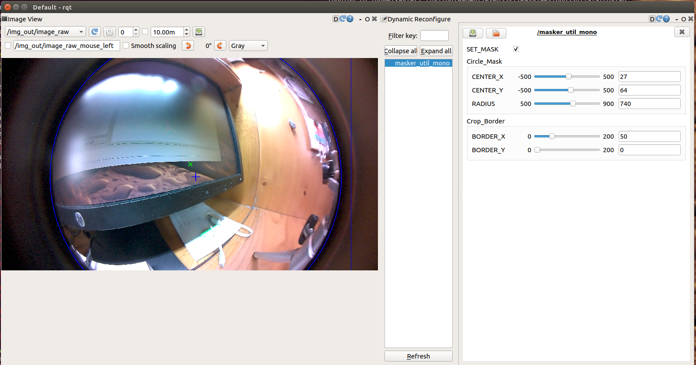
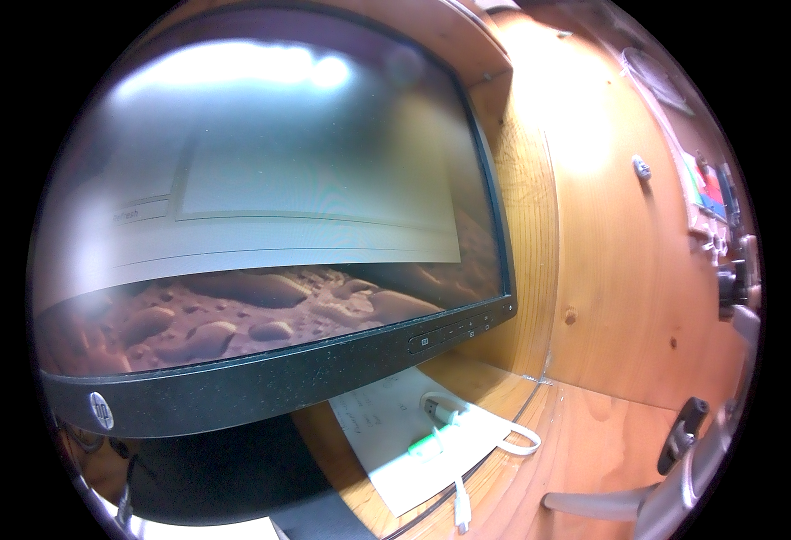
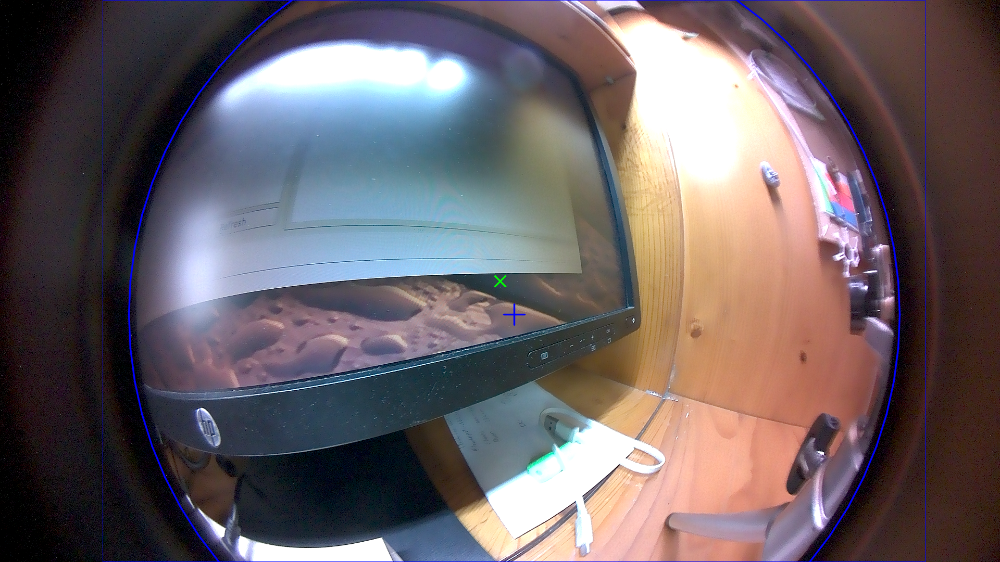

# masker_util

<a href="LICENSE" ></a>

A ROS package for Image masking &amp; cropping utility for fisheye / wide-angle / omnidirectional image.



## Installation

Git clone the repository into your workspace (e.g. catkin_ws).
```bash
$ cd catkin_ws/src
$ git clone https://github.com/1487quantum/masker_util.git
```

After that, recompile the workspace.
```bash
$ catkin_make
```

## Launch files
Launch the masker_util node via *masker_util_mono.launch*.
```bash
$ roslaunch masker_util masker_util_mono.launch
```

To mask the image feed, the *masker_util_stereo.launch* could be used.
```bash
$ roslaunch masker_util masker_util_stereo.launch
```

## Modes
There are 2 modes for the masker utils:
* **Normal Mode**: Apply the mask on the output image.
* **Debug Mode (Default)**: Used to position and set the mask in place, with the markings overlay to guide the placement of the mask.

| Normal Mode | Debug Mode |
| ----------- | ---------- |
|  |  |

**Legend**
- *Green cross marker*: Represents the center of the image.
- *Blue plus marker*: Represnts the center of the circle mask.
- *Blue circle*: Represents the mask. Area outside the circle would be filtered out as black.
- *Rectanglular border*: Represents the new image size, which would be cropped to *center* the image output.

## Parameters
The mask could be adjusted via *rqt_reconfigure*.
| Parameters | Description | Type | Range |
| ---------- | ----------- | ---- | ----- |
| SET_MASK   | To toggle *Debug Mode* | Boolean | 0 <-> 1 |
| CENTER_X   | The center x coordinate of the circle mask | Int(eger) | -500 <-> 500 |
| CENTER_Y   | The center y coordinate of the circle mask | Int(eger) | -500 <-> 500 |
| RADIUS     | The radius of the circle mask | Int(eger) | 500 <-> 900 |
| BORDER_X   | The width padding of the cropped image output. Set it to 0 for no padding. | Int(eger) | 0 <-> 200 |
| BORDER_Y   | The height padding of the cropped image output. Set it to 0 for no padding. | Int(eger) | 0 <-> 200 |

> **Note:** The *param* directory is used to store the parameters of the masks (in *.yaml* format).

